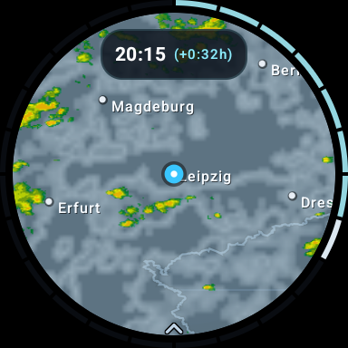

# DWT – Das Wetter tickt

A standalone Wear OS app for viewing rain and cloud radar data directly on your watch.



## Features

- Animated radar timeline with past observations and forecasts
- Toggleable rain and cloud layers
- Location-aware map with an optional locally stored last position
- Pan and zoom controls designed for round watch displays
- City labels, country outlines, and a compact timeline around the screen
- Automatic refresh and frame caching for smooth playback

## Controls

| Action | Control |
| --- | --- |
| Move through time | Rotate the crown or drag around the screen edge |
| Play or pause | Tap the map |
| Pan the map | Drag the map |
| Change zoom | Double-tap, or double-tap and drag vertically |
| Return to now and your location | Long-press the map |
| Choose radar layers | Open the menu at the bottom |

Location access is optional. Without it, the app opens with a general view of Germany.

## Build

Requirements: Android SDK 35 and JDK 17.

```sh
./gradlew assembleDebug
```

The debug APK is written to `app/build/outputs/apk/debug/app-debug.apk`.

To install it on a watch connected through ADB:

```sh
adb install -r app/build/outputs/apk/debug/app-debug.apk
```

Published GitHub releases automatically build signed APK and AAB artifacts from
`vMAJOR.MINOR.PATCH` tags. See [docs/releasing.md](docs/releasing.md).

## Data Source

Data basis: Deutscher Wetterdienst (DWD), WarnWetter raster data reproduced
visually.

This project is independent and not affiliated with or endorsed by DWD. See
[DATA_SOURCES.md](DATA_SOURCES.md) for the publication status and rights
notice.

## License

The original project code and assets are available under the [MIT License](LICENSE).
DWD data and third-party material are not covered by that license.
